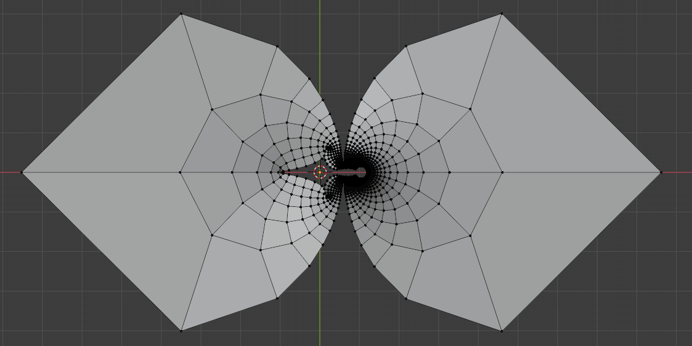

# Riemann Hypothesis Visualizations

Exploring the [Riemann zeta function](https://en.wikipedia.org/wiki/Riemann_zeta_function) and its
analytic continuation through interactive visualizations.

## What it does

A flat 50x50 grid of points `s = x + iy` in the complex plane is fed through the
analytically continued zeta function (via the Dirichlet eta function, valid for `Re(s) > 0`).
Each point is then plotted at `(Re(zeta(s)), Im(zeta(s)), |s|)`, producing a surface that shows
how the zeta function warps the complex plane. The visualization animates the transition from
the flat input grid to the fully transformed surface.

## Plotly version

[riemann_zeta_plotly.py](riemann_zeta_plotly.py) generates an interactive, animated 3D plot
using [Plotly](https://plotly.com/python/).

### Run with Docker

```bash
docker build -t riemann-zeta-plotly .
docker run --rm -v "${PWD}/output:/app/output" riemann-zeta-plotly
```

### Run locally

```bash
pip install -r requirements.txt
python riemann_zeta_plotly.py
```

Either way, the output is written to `output/riemann_zeta.html`. Open it in a browser to rotate,
zoom, and play the animation.

## Original Blender version

The project started as a [Blender](https://www.blender.org/) Python script that produces the
same kind of visualization as a rendered animation. The original script and a sample render are
kept in [old-blender-files](old-blender-files).


